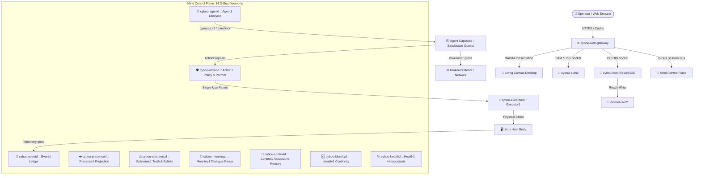

<!--
SPDX-FileCopyrightText: 2026 Cybou contributors
SPDX-License-Identifier: MIT
-->

<div align="center">


# CYBOU

**The Sovereign, Agent-Native Operating Environment & Cognitive Desktop Platform**

*Debian 13 · 100% Rust & WebAssembly · Zero-Trust Host Sandboxing · Local-Sufficient*

[](docs/TESTING.md)
[](https://www.rust-lang.org/)
[](docs/DEPLOYMENT.md)
[](docs/ARCHITECTURE.md)
[](LICENSES/MIT.txt)

</div>

---

## 🌟 What is CYBOU?

**CYBOU** is a next-generation, agent-native operating environment and sovereign cognitive desktop designed from first principles in **100% Rust** for Debian 13 Linux (servers, containers, edge nodes, and workstations).

Unlike conventional "AI assistants" and "agentic frameworks" that collapse reasoning, identity, memory, execution, and security into a single monolithic LLM prompt, **CYBOU establishes a strict, deterministic cognitive control plane (Mind)** that continuously observes, governs, and maintains the machine.

AI models and autonomous agents in CYBOU are **untrusted guests, not system owners**. They execute in kernel-confined sandboxes (cgroups v2, Landlock LSM, mount namespaces, mediated egress) and must propose typed actions through an auditable policy evaluation gate before any physical change can occur.

---

## 💎 Core Value Proposition & Pillars

| Invariant | Sovereign Principle |
|---|---|
| 🧠 **Model ≠ Identity** | LLMs are replaceable computational faculties; biography, commitments, and identity belong exclusively to Mind. |
| 🏛️ **Agent ≠ Mind** | Autonomous agents are unprivileged guest processes inside kernel sandboxes, never system owners. |
| 🛡️ **Tool Access ≠ Permission** | Having an API or MCP tool available does not grant authority; every action requires an evaluated policy permit. |
| 📜 **Observation ≠ Knowledge** | Sensory telemetry metrics are hypotheses carrying raw readings; knowledge requires causal epistemic grounding. |
| 🔒 **Confidence ≠ Authorization** | High model certainty or prompt persuasion is never treated as a security authorization. |
| ⚡ **Command Sent ≠ Verified Outcome** | An action is only complete once physical effects are independently re-observed by telemetry. |
| 👁️ **Perception ≠ Truth** | Perception is a local estimate; ground truth is recorded in the append-only cryptographic event ledger. |
| ⏳ **Attention ≠ Biography** | Ephemeral workspace focus coalitions decay; persistent autobiographical memories are explicitly committed. |

### 1. 🧠 Deterministic Cognitive Control Plane (Mind)
- **14 Process-Isolated Micro-Daemons**: Operating on the D-Bus session bus (`org.cybou.Mind.*`), each owning a distinct cognitive domain: biography (`identityd`), epistemic truth & beliefs (`epistemicd`), associative context (`contextd`), attention (`workspaced`), natural language meaning (`meaningd`), prediction (`predictord`), capability health (`healthd`), and homeostatic lifecycle (`lifecycled`).
- **100% Local-Sufficient**: Core cognition requires **no cloud connection, no GPU accelerator, and no probabilistic model**. It runs deterministically with sub-millisecond response times even during complete network isolation.
- **Natural Language Meaning & Dialogue Memory (`cybou-meaningd`)**: Deterministically parses user utterances into structured cognitive acts (`Ask`, `Instruct`, `Assert`), formulates verified `ResponsePlan` structures, and realizes answers without hallucination.

### 2. 🛡️ Kernel-Enforced Agent Capsules (`Agent1`)
- **Strict OS-Level Confinement**: Autonomous coding and research agents run inside isolated Linux capsules using cgroups v2 resource limits (CPU, RAM, max tasks), Landlock filesystem confinement, private namespaces, and mediated network egress.
- **Declarative Operator Profiles**: Operators declare strict profiles (e.g. `opencode-sandbox`, `research-confined`) defining approved workspaces, memory ceilings, spend limits, allowed network domains (`github.com`, `crates.io`), and model classes.
- **Host Capacity Arithmetic**: Automatic admission control prevents resource exhaustion by enforcing host-wide session limits and memory budgets.

### 3. 📜 Cryptographic Event Ledger & Truth Recovery (`cybou-eventd`)
- **Tamper-Evident Hash Chain**: All observations, decisions, state transitions, and outcomes are permanently committed to an append-only, SHA-256 hash-chained SQLite v3 journal.
- **Auditable Truth**: Live deployments stream tens of thousands of verified cryptographic contributions, ensuring every claim is backed by genuine system telemetry.
- **Transitive Cryptographic Erasure (ADR-0028)**: Users can request complete erasure of specific records, which safely clears payloads, increments erasure epochs, and invalidates derived projections.

### 4. 🌌 Living Canvas Spatial Desktop (Rust / WASM)
- **Zero-Latency Spatial UI**: A GPU-accelerated, infinite-canvas desktop written in **Leptos and WebAssembly**, offering sub-millisecond rendering with zero compiler warnings.
- **20+ Specialized Reactive Cards**:
  - 🖥️ **Sandboxed Shell (`cybou-shelld`)**: Isolated per-session `JailFs` terminal environments.
  - 📁 **Host File Manager & Editor**: Authenticated, unprivileged host browsing via `cybou-host-filesd@<uid>`.
  - 🌐 **Dynamic Cognitive Graph**: Real-time visualization of host services, `/proc` processes, and epistemic beliefs.
  - 📊 **System Monitor**: Live hardware metrics (CPU load, memory pressure, disk I/O, network bandwidth).
  - 🤖 **Agent Capsule Hub**: Live monitoring, telemetry inspection, and lifecycle control of running agents.
  - 📒 **Personal Hub**: Persistent, sovereign personal data management (Notes, Contacts, Mail, Calendar).
  - 🧠 **Lifelong Learning**: Candidate extraction, empirical promotion gates, and durable artifact lineages.

### 5. 🔐 Zero-Trust Privilege Separation & Action Governance
- **PAM-Authenticated Isolation (`cybou-authd`)**: The web gateway never runs as root or checks passwords directly. It verifies credentials through `cybou-authd` over `/run/cybou/auth.sock` and maps sessions to unprivileged Linux UIDs.
- **Unprivileged Host Access (`cybou-host-filesd`)**: File operations for logged-in users are handled by dedicated per-UID systemd instances communicating over restricted sockets (`/run/cybou-host-files/<uid>/owner.sock`).
- **Typed Action Execution (`Action1` & `Executor1`)**:
  ```text
  Observation / Proposal → Mind Policy Evaluation → Single-Use Permit → Executor1 → Body Effect → Independent Re-Observation → Outcome
  ```

---

## 🏗️ System Architecture



---

## 📊 Subsystem Capability Matrix

| Subsystem | Daemon / Component | Status | Architectural Invariant |
|---|---|---|---|
| **Cognitive Journal** | `cybou-eventd` (`Event1`) | **Production Live** | Append-only, SHA-256 hash-chained SQLite v3 ledger; single canonical writer. |
| **Cognitive Graph** | `cybou-presenced` (`Presence1`) | **Production Live** | Dynamic synthesis of systemd units, `/proc` processes, and epistemic beliefs. |
| **Epistemic Truth** | `cybou-epistemicd` (`Epistemic1`) | **Production Live** | Explicit distinction between *observed fact*, *hypothesis*, and *disputed belief*. |
| **Dialogue & Meaning** | `cybou-meaningd` (`Meaning1`) | **Production Live** | Deterministic cognitive act parsing & response planning without cloud LLMs. |
| **Associative Context** | `cybou-contextd` (`Context1`) | **Production Live** | Bounded graph activation from explicit cognitive seeds. |
| **Identity & Biography**| `cybou-identityd` (`Identity1`) | **Production Live** | Subject continuity preserved across daemon restarts and machine reboots. |
| **Agent Capsules** | `cybou-agentd` (`Agent1`) | **Production Live** | Kernel-enforced Landlock + cgroups v2 sandbox with ACP agent pack integration. |
| **Action & Governance** | `cybou-actiond` / `executord` | **Production Live** | Typed proposal &rarr; policy evaluation &rarr; opaque single-use permit &rarr; execution. |
| **Host Files Boundary**| `cybou-host-filesd@<uid>` | **Production Live** | Unprivileged per-UID socket (`/run/cybou-host-files/<uid>/owner.sock`). |
| **Sandboxed Shell** | `cybou-shelld` / `cybou-jailfs` | **Production Live** | Per-session isolated working directory state; zero state leakage across seats. |
| **Lifelong Learning** | `LearningHub` (`learning-store`)| **Production Live** | Layered candidate induction, empirical promotion gates, durable artifact lineages. |
| **Personal Hub** | `PersonalHub` (`personal-store`)| **Production Live** | Sovereign local persistence for notes, contacts, calendar events, and mail. |
| **Living Canvas UI** | `living-canvas` (WASM) | **Production Live** | Zero-warning Leptos spatial desktop with 20+ responsive cards & snap guides. |

---

## 🚀 Getting Started

### Prerequisites
- **Operating System**: Linux (Debian 13 recommended) or WSL2 on Windows.
- **Toolchain**: Rust 2024 edition (`rustup update stable`), `trunk` for WebAssembly compilation.
- **Dependencies**: `libdbus-1-dev`, `libssl-dev`, `pkg-config`, `libpam0g-dev`, `bubblewrap`.

### 1. Build and Test the Workspace

```bash
# Clone the repository
git clone https://github.com/cybou-fr/CYBOU.git
cd CYBOU

# Check all workspace crates
cargo check --workspace

# Run all unit and integration test suites (88+ suites, 100% passing)
cargo test --workspace

# Verify WebAssembly frontend build (0 warnings, 0 errors)
cargo check --target wasm32-unknown-unknown -p living-canvas
```

### 2. Run Locally in Development Mode

```bash
# Build Living Canvas frontend
trunk build crates/living-canvas/index.html

# Run the Web Gateway
cargo run -p cybou-web-gateway
```

Navigate to `http://127.0.0.1:8080` in any modern web browser.

### 3. Deploy to Debian 13 Server / VPS

CYBOU includes an automated deployment pipeline for remote servers:

```bash
# Deploy to server configured in scripts/vps-env.sh
./scripts/deploy-vps.sh
```

---

## 🗺️ Repository Structure

```text
crates/
├── cybou-protocol/       Shared protocol contracts, cognitive envelopes, and types
├── cybou-web-contracts/  Strongly-typed web API projections and wire schemas
├── cybou-storage/        Cryptographic hash-chain SQLite v3 journal engine
├── cybou-crypto/         Cryptographic hashing, signatures, and identity utilities
├── cybou-fabric/         D-Bus message encoding, decoding, and client fabric
├── cybou-runtime/        Process management, cgroups v2, Landlock, and bubblewrap sandboxing
├── cybou-authd/          Privileged PAM authentication daemon
├── cybou-host-filesd/    Unprivileged per-UID host filesystem owner daemon
├── cybou-shelld/         Sandboxed shell engine and per-session state manager
├── cybou-jailfs/         Virtual sandboxed filesystem tree implementation
├── cybou-eventd/         Canonical Journal writer daemon (Event1)
├── cybou-presenced/      Presentation-ready cognitive projection daemon (Presence1)
├── cybou-epistemicd/     Epistemic truth, evidence, and belief daemon (Epistemic1)
├── cybou-contextd/       Associative context and memory activation daemon (Context1)
├── cybou-meaningd/       Natural language cognitive act parser daemon (Meaning1)
├── cybou-identityd/      Subject continuity and biography daemon (Identity1)
├── cybou-intentiond/     Commitment tracking and obligation daemon (Intention1)
├── cybou-predictord/     Robust statistical prediction daemon (Predictor1)
├── cybou-selfd/          Autobiographical self-model daemon (Self1)
├── cybou-healthd/        Subsystem health and homeostatic monitoring daemon (Health1)
├── cybou-telemetryd/     Bounded host telemetry and system insight daemon (Telemetry1)
├── cybou-actiond/        Action proposal, policy criticism, and permit daemon (Action1)
├── cybou-executord/      Privileged Body action executor daemon (Executor1)
├── cybou-remediationd/   Autonomous remediation coordinator daemon
├── cybou-agentd/         Agent capsule launcher and runtime daemon (Agent1)
├── cybou-agent-opencode/ Reference OpenCode agent pack implementation
├── cybou-web-gateway/    Axum HTTP/WebSocket gateway and REST API surface
└── living-canvas/        Leptos/WASM reactive spatial desktop UI
```

---

## 📚 Documentation & Architecture Decisions

- 🧠 **[Mind Model](docs/MIND_MODEL.md)**: Conceptual foundations, invariants, and cognitive continuity.
- 📖 **[Architecture Overview](docs/ARCHITECTURE.md)**: Deep dive into the 14-daemon Mind control plane.
- 📊 **[Current State](docs/CURRENT_STATE.md)**: Authoritative record of implemented and verified boundaries.
- 📜 **[Architecture Decision Records (ADRs)](docs/adr/README.md)**: 45+ comprehensive ADRs documenting every design choice.
- 🧪 **[Testing Strategy](docs/TESTING.md)**: Test invariants, live-bus verification, and failure modes.
- 🚀 **[Deployment Guide](docs/DEPLOYMENT.md)**: Step-by-step production deployment on Debian 13.
- 🔒 **[Security Model](docs/security/README.md)**: Zero-trust host boundaries and confinement rules.

---

## 🤝 Support & Partnerships

CYBOU is independently researched and developed. For collaboration, enterprise enablement, or security advisories:

- 🌐 **Website**: [https://cybou.fr](https://cybou.fr/)
- 📧 **Contact**: [info@cybou.fr](mailto:info@cybou.fr)

### Donations & Sponsorship

| Asset | Address |
|---|---|
| **Solana (SOL)** | `39iqkHNMqncEPp3p52zKwUHnYzk2MJbcaHyY4Hhg2fWC` |
| **Bitcoin (BTC)** | `bc1q5a0yq9kflu755jz9a7juveelj3lrnaml6cnjur` |
| **Ethereum / USDT (ERC-20)** | `0xf4B7fF998600617785ad7D4d0aad3D2Ea342526B` |
| **TRON / USDT (TRC-20)** | `TCWmbxJXwes4GLZkVjpKpY3p34mjg4C6qo` |

---

## 📄 License

Code and documentation are licensed under the **MIT License** ([LICENSES/MIT.txt](LICENSES/MIT.txt)). Design assets and trademarks are licensed under **CC BY-SA 4.0** ([LICENSES/CC-BY-SA-4.0.txt](LICENSES/CC-BY-SA-4.0.txt)) in accordance with the REUSE specification.
