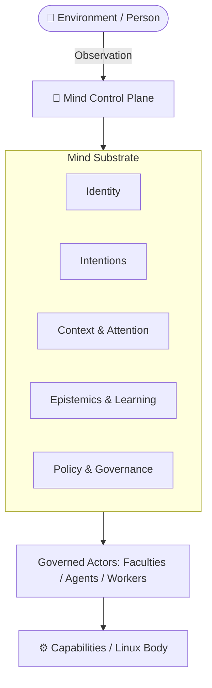

<!--
SPDX-FileCopyrightText: 2026 Cybou contributors
SPDX-License-Identifier: MIT
-->

# Cybou Mind Model

## Purpose

Cybou is built around a persistent cognitive runtime and future control plane rather than around a
language model.

Mind preserves typed cognitive state across restarts and stronger continuity boundaries. The
long-term target extends this into governance: Cybou continuously understands, protects, and
maintains its managed environment while models, agents, workers, tools, and interfaces remain
replaceable.

Mind is **not** a chatbot, language model, vector database, shell agent, security model, or one
monolithic service.

```text
persistent Mind
+
replaceable faculties/models
+
disposable agents/workers
+
governed capabilities
+
observed outcomes
+
lifelong learning
```

## Terminology and scope

Terms such as **Mind**, **identity**, **self**, **attention**, and **cognitive** describe software
architecture and state ownership in this project. They are not claims that Cybou is conscious,
sentient, or biologically equivalent to a human mind.

- **Current substrate** — behaviour that exists and is gated.
- **Future target** — capabilities described by Proposed ADRs and not yet built.

`CURRENT_STATE.md` remains authoritative for what is implemented today.

## Body, Mind, and Presence

```text
Body
  NixOS, Plasma, hardware, processes, devices, network/system state, executors

Mind
  persistent cognitive substrate/control plane

Presence
  outward presentation/projection boundary
```

```text
Plasma ≠ Mind
Journal ≠ Mind
presenced ≠ Mind
model ≠ Mind
agent ≠ Mind
worker ≠ Mind
executor ≠ Mind
```

## Cognitive topology



The diagram is not a neural analogy.

## Organ semantics

| Organ | Engineering question | Owned responsibility |
|---|---|---|
| `cybou-eventd` | What happened? | canonical durable history/Event1 |
| `cybou-identityd` | Which identity continues? | identity/session continuity |
| `cybou-intentiond` | What remains unresolved? | intentions |
| `cybou-predictord` | What is expected? | prediction/calibration |
| `cybou-selfd` | What assessment exists? | self projection |
| `cybou-workspaced` | What matters now? | bounded attention |
| `cybou-presenced` | What is exposed outward? | presentation aggregation |

Future security/model/agent/tool owners require explicit owner decisions.

## Core invariants

### 1. Durable before visible

Durable contribution is committed before downstream projection/presentation may claim acceptance.

### 2. Causality over loose memory

Journal is causal/evidence-bearing history, not a conversation transcript. Derived state may not
launder privacy, sensitivity, retention, or erasure obligations.

### 3. Identity is not a process

Daemon/model/agent replacement is not a birth event.

### 4. Attention is not biography

Journal is durable history; Workspace is bounded reconstructible attention.

### 5. Models are faculties, and language is a boundary

A language implementation may use grammar, semantic parsing, local models, governed remote models,
or hybrids. **No generative model is required**.

```text
utterance      ≠ meaning
interpretation ≠ truth
ambiguity      ≠ permission to guess
request        ≠ authorization
```

Models do not become identity authority, biography owner, Journal writer, intention owner,
authorization authority, privileged executor, or security-policy authority.

```text
core cognition → local only
```

This means authoritative cognitive/control ownership remains local. Remote inference may be used as
a governed faculty; provider loss is a capability deficit, not loss of Mind.

### 5a. Learning is layered, and learned state outranks nothing

```text
memory update
≠ association
≠ linguistic and behavioural learning
≠ procedural skill learning
≠ neural adaptation
```

```text
learned X          ≠ X is true
learned preference ≠ permission
learned procedure  ≠ authorization
```

### 5b. Agents and workers are governed subjects, not authorities

```text
Faculty = ability
Worker  = bounded temporary task actor
Agent   = longer-lived responsibility actor
Mind    = persistent continuity/governance
```

Prompt text, tool discovery, model output, or successful history do not grant authority.

### 6. External actions return as observations

```text
Perception / request / security signal
        ↓
       Mind
        ↓
proposal / plan
        ↓
Authorized Action Boundary
        ↓
capability / executor / broker
        ↓
Body / external environment
        ↓
observed consequence
        --> Observation / Outcome
```

The authorization boundary owns general authorization and execution. Command dispatch is not outcome evidence.

### 7. Consolidation derives; it does not rewrite

```text
summary ≠ source evidence
consolidation ≠ history rewrite
expiry ≠ silent deletion
coordinator ≠ owner of every organ
```

### 8. Perception is not truth

Accepted observation is evidence, not proof. Observed/reported/inferred/assumed/disputed/
superseded/stale/unknown remain distinguishable.

### 9. Forgetting and values are governed

Retention, sensitivity, privacy scope, erasure, cost, reversibility, urgency, evidence, and resource
budget are explicit policy inputs. Priority is not authority.

### 10. Security enforcement does not depend on model obedience

```text
model unavailable
≠ firewall policy unavailable
≠ credential boundary unavailable
≠ capability boundary unavailable
≠ authorization policy unavailable
```

### 11. Autonomy is bounded by standing policy

```text
past approval ≠ standing authorization
high confidence ≠ standing authorization
successful history ≠ standing authorization
```

## The current substrate

The repository already demonstrates the process/ownership/lifecycle/capability substrate and
advancing the perception, epistemic, erasure, sensitivity, context, and delivery work described by
`CURRENT_STATE.md`.

It does **not** yet provide the full future control plane:

- no language runtime behind the meaning boundary;
- no general lifelong-learning runtime;
- no authorized external executor;
- no first-class agent/worker runtime;
- no local/remote model broker;
- no general MCP/tool broker;
- no firewall/endpoint/SSH/credential control plane;
- no unattended remediation engine;
- no distributed security perimeter.

## Prediction and calibration

Prediction remains separate from model generation. Expected state, observed state, confidence, and
calibration remain separately representable.

## Self model

Self is structured state, not generated autobiography. Future security posture and active actors may
be projected only after explicit owners exist.

## Workspace and global attention

Workspace remains bounded active context. Incidents, tasks, intentions, and maintenance pressure may
compete for attention without becoming one semantic domain.

## Presence

Presence remains an outward projection. UI does not reimplement cognitive/security ownership.

## Lifecycle and consolidation

Lifecycle orchestrates bounded maintenance/recovery. It does not become owner of learned state,
security policy, firewall state, agents, or credentials.

## Degraded cognition

Missing optional facilities become capability deficits rather than automatic Mind death. The same
pattern should govern future provider/agent/tool failures.

## Grounded and distributed cognition

This grounds world state in provenance/epistemics and governs retention, sensitivity, context, erasure,
and the distributed prototype.

## Language and meaning

```text
human language
→ MeaningInterpretation
→ ReferenceResolution
→ CognitiveAct
→ Mind

Mind
→ ResponsePlan
→ language realization
```

## Lifelong learning

ADR-0032/0033 define layered learning and learned-artifact governance.

## Authorized agency

```text
proposal
→ criticism/checks
→ decision
→ capability authorization
→ typed executor
→ execution
→ observation
→ outcome
```

It is explicitly not `LLM → privileged shell` or `agent → root`.

## Agent-native runtime

Agents/workers/models/tools become governed subjects. Managed MCP/tool use and local/remote model use
go through explicit brokers and grants.

See ADR-0034 and ADR-0035.

## Autonomous security and operations

```text
Observe → Assess → Predict → Decide → Authorize → Act → Verify → Learn
```

Target domains include firewall/network exposure, endpoint/process state, services/packages,
SSH/access, credentials, agents/workers, model usage, MCP/tool usage, and self-healing.

See ADR-0036.

## Distributed perimeter governance

Governance extends across nodes and perimeter once distributed continuity semantics exist.

## Example future loop

Illustrative future scenario, not current behavior:

```text
Owner policy:
development services must not be publicly reachable.
Low-risk reversible containment is pre-authorized.

1. perception observes a public listener
2. epistemics records evidence/freshness
3. security assessment compares observed state with policy
4. local or governed remote inference may assist diagnosis
5. policy authorizes reversible containment
6. firewall executor narrows exposure
7. independent observation verifies the result
8. Outcome records containment; root cause may remain unresolved
9. bounded worker investigates
10. learning may propose a reusable procedure but gains no authority
11. Presence explains what happened
```

## Milestone meaning

| Capability | System meaning |
|---|---|
| Durable memory | accepted contributions become visibly live |
| Causal integrity | biography gains stricter causal and hash semantics |
| Single writer | the Journal has one canonical writer |
| Process ownership | cognitive responsibilities gain isolated owners |
| Lifecycle and consolidation | continuity gains sleep, wake and recovery |
| Degraded cognition | failure and pressure become explicit capability state |
| Grounded cognition | perception, epistemics, retention, sensitivity and context become governed |
| Meaning | language crosses an explicit typed boundary |
| Lifelong learning | experience becomes governed learned behaviour and artifacts |
| Authorized agency | external action crosses authorization and observation |
| Agent-native runtime | agents, workers, models and tools become governed subjects |
| Autonomous operations | security and operations act under standing policy |
| Distributed governance | governance extends across nodes and perimeter |

## Design test for future features

When a new AI, UI, planner, sensor, worker, agent, MCP server, model provider, or executor is
proposed, ask:

1. What state does it own and never own?
2. What is its verified identity?
3. Which context may it receive?
4. Which capabilities/tools/network destinations may it use?
5. Can it delegate authority?
6. Can it be replaced without replacing identity/biography?
7. Where is authorization decided?
8. How is the real result independently observed?
9. What happens when outcome is unknown?
10. What is its retention/erasure responsibility?
11. Does failure become a bounded deficit?
12. Can security still enforce policy with models unavailable?
13. Where is standing authorization recorded?

If these questions have no clear answers, the feature is probably crossing an architectural
boundary.

## Related documents

- `CURRENT_STATE.md`
- `ARCHITECTURE.md`
- `ROADMAP.md`
- `mind/COGNITIVE_PROTOCOL.md`
- `mind/JOURNAL.md`
- `mind/ORGAN_CONTRACTS.md`
- `mind/WORKSPACE.md`
- `mind/PRESENCE_API.md`
- `adr/ADR-0001-system-architecture.md`
- `adr/ADR-0002-cognitive-causality-and-journal-invariants.md`
- `adr/ADR-0018-privacy-classification-and-replication.md`
- `adr/ADR-0021-language-models-are-optional-faculties.md`
- `adr/ADR-0022-authorized-action-boundary.md`
- `adr/ADR-0024-cognitive-lifecycle-and-consolidation.md`
- `adr/ADR-0025-grounding-epistemics-and-cognitive-governance.md`
- `adr/ADR-0030-transparent-context-delivery.md`
- `adr/ADR-0031-structured-meaning-and-cognitive-acts.md`
- `adr/ADR-0032-layered-lifelong-learning.md`
- `adr/ADR-0033-learned-artifact-governance.md`
- `adr/ADR-0034-governed-agents-workers-and-tools.md`
- `adr/ADR-0035-governed-model-brokerage.md`
- `adr/ADR-0036-autonomous-security-control-plane.md`
