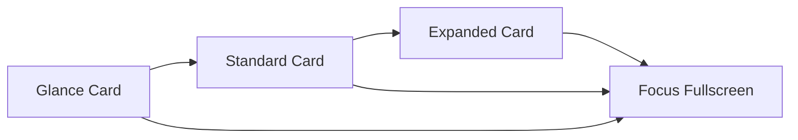

<!--
SPDX-FileCopyrightText: 2026 Cybou contributors
SPDX-License-Identifier: MIT
-->

# ADR-0044: CYBOU Spatial Desktop Architecture: Infinite Canvas, Panel 2.0, Clusters, Semantic Zoom, Typed Relations, and Non-Cognitive Presentation Invariants

## Status

Proposed

## Context

ADR-0037 established a web-first Presence projection delivered via `cybou-web-gateway` as a Rust/WASM application. ADR-0040 extended this with a movable, resizable, collapsible Card and Deck layout schema (v9) alongside bounded CYBOU Shell capabilities.

However, treating the web desktop as an emulation of a traditional Linux window manager (like X11/Wayland desktop environments) or a page-routed Single Page Application (SPA with fixed routes like `/services`, `/logs`, `/agents`) misrepresents what CYBOU is:

1. **A cognitive system is not a window manager.** Traditional desktop windows with min/max/close buttons manage operating system processes and GUI windows. In CYBOU, the host system (**Body**) runs Debian 13 systemd services, Linux namespaces, and cgroups, while the **Mind** maintains continuity, epistemology, and causal governance. The desktop is a **spatial presence projection**—a living, interactive map of host reality and cognitive state.
2. **Infrastructure and investigations are spatial graphs, not tabs.** When diagnosing an incident, an operator moves from an insight finding to a systemd service, to relevant journal logs, to a port listener, to an active agent capsule. Page-based routing destroys this cognitive context by hiding previous steps.
3. **Scale requires level-of-detail (LOD), not geometric scaling.** Shrinking an entire desktop by 50% renders text illegible. An operator zooming out over a large cluster needs **semantic zoom**: transitioning from detailed telemetry charts to status chips, to aggregate regional summaries.
4. **Presentation must never contaminate cognition or authorization.** Proximity on a canvas does not constitute a dependency. Grouping two panels does not authorize a grant. Closing a panel does not terminate an agent capsule or stop a systemd daemon.

This ADR establishes the complete architectural model for the **CYBOU Spatial Desktop**, formalizing Panel 2.0 representations, semantic clusters, spatial anchors, camera navigation, typed causal relations, contextual spawning, and strict non-cognitive presentation invariants.

---

## The Core Formula

```text
Debian 13           = Body (host execution, kernel, storage, network)
CYBOU Mind          = Understanding + Memory + Epistemology + Governance (canonical owner)
CYBOU Desktop       = Infinite spatial Presence (interactive map of reality)

Panel               = Single discrete object / tool / capability (code: Card, UX: Panel)
Deck                = Presentation composition (multiple Panels in one geometry), not identity
Cluster             = Semantic spatial region bounding multiple Panels, not ownership
Relation            = Typed system causality or resource link, not authorization
Anchor              = Named camera bookmark / region of the Canvas
Viewport            = The active observation window of the operator
Level of Detail     = Semantic abstraction level governed by zoom
Canvas state        ≠ Biography (DOM / localStorage layout ≠ Mind truth)
```

---

## Decision

### 1. Spatial Topology vs Page-Based Routing

CYBOU Desktop rejects traditional tabbed or page-based navigation (`/home`, `/services`, `/logs`, `/agents`, `/settings`). Instead, the entire system exists on a single, unbounded, 2D continuous Canvas.

Operators construct their own physical spatial arrangement:

```text
  MIND SUBSTRATE
  (Identity, Context, Beliefs, Attention, Journal)
  ↑
  
SECURITY            ←     HOME     →            INFRASTRUCTURE
(Firewall, Leases)        (Insight, Agents,     (Nginx, PostgreSQL,
  Activity, Forecast)   Storage, Network)
  
  ↓
  AGENTS
  (OpenCode Capsules, Task Workspaces)
  
  ↓
  DEVELOPMENT
  (Source Repositories, Sandboxes)
```

Navigation across areas is performed through continuous camera translation, spatial anchors, and semantic zoom, preserving mental context across multi-step operations.

### 2. Panel 2.0 State Machine

The internal Rust representation retains the stable identifier types (`CardId`, `CardInstance`, `CardSpec`, `CardGeometry`), while the human-facing UX designates every interactive unit as a **Panel**.

Every Panel supports four distinct presentation representations:

| State | Purpose | Default Dimensions | Content Representation |
|---|---|---|---|
| **Glance** | Highly compact status chip | ~220 × 70 px | Live icon, unit/service name, primary metric or state badge (e.g. `● nginx.service running`). |
| **Standard** | Regular operational view | ~360 × 260 px | Core operational telemetry, health verdict, primary controls, and contextual links. |
| **Expanded** | Comprehensive in-canvas analysis | ~640 × 480 px | Full telemetry traces, historical readings, active dependencies, log streams, and policy criticism. |
| **Focus** | Temporary viewport takeover | Viewport-fitted | Maximized view for deep investigation. **Focus does not mutate canonical canvas coordinates.** |

#### Live Collapsed Status Chips
When a panel is collapsed, it does not become a dead placeholder; it acts as a live, updating status chip:
- Service: `● PostgreSQL · 82 MB`
- Certificate: `⚠ Certificate · 8 days remaining`
- Agent: `● OpenCode · Running · €0.014 spend`



### 3. Semantic Zoom (Level of Detail)

Zoom is not a naive CSS transform scale; it is an epistemically governed **Level of Detail (LOD)** engine:

- **Zoom 25% (Macro Domain Level)**: Panels fade into regional cluster pills. Only macro health indicators, active incident badges, and cluster titles are visible (e.g. `PRODUCTION: 7 services ●, 1 warning ⚠`).
- **Zoom 50% (Entity Status Level)**: Panels display Glance chips with status dots, primary resource utilization, and active task badges.
- **Zoom 100% (Standard Operational Level)**: Full Standard panels with actionable metrics, controls, and local relation lines.
- **Zoom 150% (Forensic Deep Dive Level)**: Detailed sparklines, raw observation readings, causal evidence rationales, criticism check records, and full relation networks appear automatically.

### 4. Semantic Clusters vs Tabbed Decks

The architecture strictly distinguishes between **Decks** and **Clusters**:

- **Deck (`DeckInstance`)**: A single geometric box containing two or more Panels organized with a tab header (`role="tablist"`). Decks solve local screen clutter for alternative views of the same subject (e.g., `nginx: Overview | Logs | Config`).
- **Cluster (`ClusterInstance`)**: An unbounded named visual region grouping multiple independent panels that share an operational domain (e.g., `DATABASE`, `PRODUCTION WEB`, `AGENT WORKSPACE`).

#### Cluster Properties:
```rust
pub struct ClusterInstance {
    pub id: ClusterId,
    pub title: String,
    pub region: Rect,
    pub panel_ids: Vec<CardId>,
    pub collapsed: bool,
    pub style: ClusterStyle,
}
```

#### Collapsible Clusters:
A Cluster can be collapsed into a single high-level card summarizing its members:
| Cluster Deck | Status Summary |
|---|---|
| **PRODUCTION** | ● Healthy · 7 services · 2 certificates · 128 MB RAM |
Clicking the cluster smoothly expands the constituent Panels at their saved relative positions.

### 5. Canvas Anchors & Camera History

1. **Canvas Anchors (`CanvasAnchor`)**:
   Instead of fragmented virtual workspaces, named bookmarks define regions on the unified canvas:
   ```rust
   pub struct CanvasAnchor {
       pub id: AnchorId,
       pub name: String,
       pub center_x: f64,
       pub center_y: f64,
       pub preferred_zoom: f64,
   }
   ```
   Selecting an anchor in the Dock or Command Palette smoothly flies the viewport camera to the target coordinates using cubic easing.

2. **Camera History (Spatial Back/Forward)**:
   The canvas runtime maintains a bounded camera history stack (`Vec<CameraState>`). Navigating from `Home` → `PostgreSQL` → `Logs` allows the operator to press `Alt+Left` (Back) to re-trace spatial movement without getting lost.

### 6. Minimap 2.0 (Spatial Radar)

The minimap provides a multi-scale spatial radar:
- High altitude: Shows named Clusters (`PRODUCTION`, `SECURITY`, `AGENTS`) with status glows.
- Activity & Incident Indicators: Clusters with failing services show an amber warning marker (`Production ⚠`); active agent execution pulses green (`Agents ●`).
- Click-to-Pan: Dragging or clicking the radar view rectangle immediately pans the main viewport.

### 7. Typed Semantic Relations & Dynamic Visibility

Relations between panels represent real causal, architectural, or observational connections, derived from Mind, Action1, and Telemetry state:

```rust
#[derive(Clone, Debug, PartialEq, Eq, Serialize, Deserialize)]
pub enum RelationType {
    DependsOn,
    Uses,
    ListensOn,
    WritesTo,
    ReadsFrom,
    Workspace,
    Model,
    NetworkAccess,
    Caused,
    RemediatedBy,
    ObservedBy,
    BelongsTo,
}
```

#### Relation Visibility Modes:
To avoid visual clutter ("spaghetti canvas"), relations are filtered dynamically:
- `Off`: No relation lines drawn.
- `Selected` (**Default**): Only relations connected to the currently selected panel(s) and their immediate neighbors are rendered.
- `Local Neighborhood`: Relations for the selected cluster.
- `All`: Full systemic topology graph.

**Critical Invariant**: A relation line drawn between an Agent and a network target represents an active grant compiled in the capsule spec; **drawing or connecting a line in the UI never grants or mutates authorization.**

### 8. Contextual Panel Spawning & Placement Resolver

Interactions inside panels spawn child panels rather than triggering route transitions:
- Inside `System Insight`: Clicking `"Inspect service"` on a `ServiceInactive` finding spawns a `ServicePanel(nginx)` to the right.
- Inside `ServicePanel(nginx)`: Clicking `"View Logs"` spawns a `LogsPanel(nginx)` below.
- Inside `LogsPanel`: Clicking a PID reference spawns a `ProcessPanel(pid)`.

#### Placement Resolver Heuristics:
1. **Details & Inspections**: Placed immediately to the right (`x + width + margin`).
2. **Logs & History**: Placed immediately below (`y + height + margin`).
3. **Dependencies**: Placed along the directional vector of the typed relation.
4. **Collision Avoidance**: If the target coordinates overlap existing panels, `PlacementResolver` spiral-scans for the nearest vacant spatial pocket.

### 9. Dual-Modal Command Interface

The interface distinguishes between creating surfaces and querying knowledge:

- **`Ctrl+Space` (Add Panel Catalogue)**:
  Opens the Panel Library modal to add system monitors, tools, or domain views to the current canvas region.
- **`Ctrl+K` (Ask CYBOU & Action Palette)**:
  Unified search, natural language queries, and contextual actions. Querying `"Why did nginx restart?"` produces a structured answer and an `[Open Evidence]` button that spawns the relevant finding and service panels.

### 10. Comprehensive Product Panel Inventory

The system organizes panels into singletons and multi-instance resource viewers:

| System Singletons | Multi-Instance Resource Viewers |
|---|---|
| • System Insight (`Telemetry1`) | • `Service(unit_name)` |
| • Recent Activity (`Action1`) | • `Process(pid)` |
| • System Forecast (`Predictor1`) | • `Certificate(domain)` |
| • Active Agents (`Agent1`) | • `Package(pkg_name)` |
| • Network & Firewall | • `Backup(backup_name)` |
| • Security Leases & Policy | • `Storage(mount_point)` |

### 11. Cross-Panel Drag-and-Drop Grammar

Spatial drag-and-drop provides expressive interaction without compromising authorization:
- Drag `Service(nginx)` → `LogsPanel`: Filters the log stream to `nginx.service`.
- Drag `Folder(/srv/project)` → `AgentsPanel`: Populates the workspace field in the launch form.
- Drag `Finding(StorageExhaustion)` → `Ask CYBOU`: Submits an explanation prompt for the telemetry condition.
- Drag `Certificate(site.pem)` → `Watchlist`: Opens confirmation dialog to declare the certificate watched.

**Invariant**: Drag operations construct drafts or filters; they **never trigger non-reversible host mutations or authorization grants without explicit user confirmation.**

### 12. Pinning Semantics: Locked vs Floating

Pinning is split into two disjoint orthogonal behaviors:
1. **Locked Position (`locked: true`)**: The panel remains at fixed canvas coordinates `(x, y)` and is ignored by auto-arrange algorithms.
2. **Floating HUD (`floating: true`)**: The panel remains pinned to the operator's viewport glass overlay during canvas panning (ideal for `Ask CYBOU`, active tasks, and temporary terminals).

---

## Architectural & Epistemic Invariants

The spatial desktop must strictly adhere to the following invariants to preserve system truth and security:

1. **`Panel ≠ Process`**: A panel is a presentation projection, not an operating system process.
2. **`Panel ≠ Owner`**: Panels do not own cognitive state; Mind organs own cognitive state.
3. **`Panel Position ≠ Semantic Meaning`**: Arranging panel A next to panel B does not create a dependency or causal link in Mind.
4. **`Cluster Membership ≠ System Dependency`**: Grouping panels in a visual cluster is purely for presentation and has zero effect on systemd unit dependencies or Landlock sandbox boundaries.
5. **`Close Panel ≠ Stop Underlying Thing`**: Closing `AgentSessionPanel` removes its visual projection; the capsule continues running inside `Agent1` until its lease expires or `stop_agent()` is explicitly called.
6. **`Drag ≠ Authorization`**: Drag-and-drop gesture never bypasses `Action1` or `cybou-authd`.
7. **`Focus ≠ Geometry Mutation`**: Focusing a panel expands it across the viewport temporarily; canonical persistent coordinates in `DesktopLayout` remain untouched.
8. **`Zoom ≠ Canonical State`**: Zoom alters the presentation level-of-detail; it does not change underlying telemetry or data structures.
9. **`Canvas State ≠ Biography`**: The contents of browser `localStorage` or DOM tree do not constitute Mind memory. Erasing local layout simply triggers `validate_and_normalize` default presentation.
10. **`UI Statement = Authoritative Projection`**: A panel must never claim "Healthy" when telemetry is unobserved, never claim "Unmetered" when spend was unread, and never claim "No actions" when Action1 was unreachable.

---

## Implementation Roadmap & Milestones

The transition from current Living Canvas to the full Spatial Desktop is organized into sequential milestones:

- **SD0: Epistemic Truth & Live Causal Wiring** *(Completed)*:
  Truthful `FindingProjection.id` linking, dynamic self-healing timeline, real `ActionRecordProjection` history, multi-dimensional `AgentRuntimeReadiness` diagnostics, and live task phase tracking.
- **SD1: Panel 2.0 Representation Engine**:
  Glance, Standard, Expanded, and Focus state transitions with live updating collapsed status chips.
- **SD2: Unbounded Canvas & Camera History**:
  Infinite continuous 2D plane with smooth inertia panning, zoom clamping, and spatial Back/Forward history stack.
- **SD3: Anchors & Minimap 2.0**:
  Named spatial camera bookmarks, Dock integration, and multi-scale status radar with incident glows.
- **SD4: Cluster Model**:
  Grouping panels into collapsible, styled, domain-bounded spatial regions.
- **SD5: Semantic Zoom & Level of Detail Engine**:
  Dynamic LOD rendering based on viewport scale thresholds (25%, 50%, 100%, 150%).
- **SD6: Typed Relations & Dynamic Link Filtering**:
  Real-time rendered causal/architectural SVG links with `Selected` and `Neighborhood` focus modes.
- **SD7: Contextual Panel Spawning & Placement Resolver**:
  Directional investigation spawning heuristics with collision avoidance.
- **SD8: Panel Library & Unified Palette**:
  `Ctrl+Space` panel catalogue alongside `Ctrl+K` unified natural language investigation palette.
- **SD9: Core System Panels**:
  `Service(unit)`, `LogStream`, `ProcessTree`, and `SystemMonitor`.
- **SD10: Bounded Tool Surfaces**:
  `FileManager`, `Terminal` (bounded/session-backed), `NetworkListeners`, and `PackageUpdates`.
- **SD11: Agent Workspace & Capsule Inspection**:
  Live ACP token consumption, diff inspector, refused boundary alerts, and workspace file browser.
- **SD12: Spatial Tasks & Notification Anchoring**:
  Persistent background task progress indicators and alert markers directing cameras to incident origins.
- **SD13: Cross-Panel Drag Grammar & Composition Presets**:
  Incident investigation and Agent Work spatial composition templates.
- **SD14: Responsive Presentation, Mobile Adaptations & Accessibility**:
  Touch gesture navigation, cluster stack views for mobile viewports, WAI-ARIA tab navigation, and full keyboard spatial movement.

---

## Consequences

### Positive
- **Unique Product Identity**: CYBOU becomes a truly spatial, living map of Linux infrastructure rather than a generic dashboard or desktop clone.
- **Continuous Operator Context**: Investigations preserve history and topology, preventing cognitive loss during complex troubleshooting.
- **Epistemic Clarity**: Strictly separating presentation layout from system causality ensures UI operations never accidentally violate governance or security boundaries.
- **Scalable to Large Hosts**: Semantic zoom and collapsible clusters allow managing complex servers without UI degradation.

### Negative / Trade-offs
- **WASM Performance & Memory**: Managing an infinite 2D canvas with dozens of live reactive panels requires rigorous DOM pruning and culling of off-screen elements.
- **Implementation Scope**: Full execution across SD1–SD14 spans multiple focused milestones.
